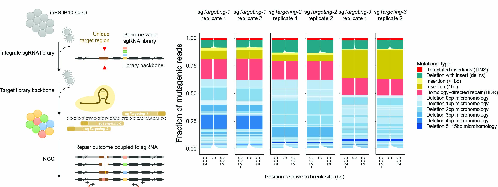

# MUSIC
This repository contains all code for analyzing mutational signatures in a genome-wide fashion. This repository accompanies our latest Nature Communications paper that performs a genome-wide screen in IB10 mES cells and a follow up screen containing 2372 sgRNAs that target 743 genes.

## Description

MUSIC_Java contains all code that is needed to reanalyze our MUSIC data from raw fastq files deposited at NCBI SRA.

MUSIC_R contains all R shiny code to inspect our genome-wide and focused candidate screen.

## Explanation

## Citation

To be added
